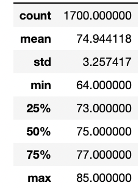
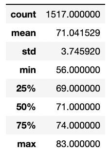
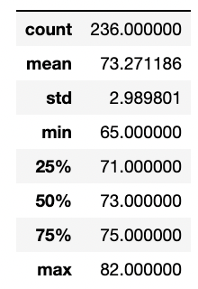
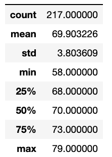
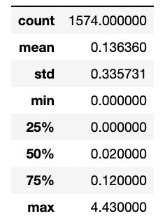
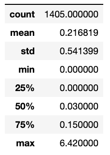

# surfs_up
Used SQLite, SQLAlchemy and Flask to analyze weather data for the island of Oahu, design a web application, and compare Oahu weather data for the months of June and December. 

# Overview of the statistical analysis:

The purpose of this analysis was to compare weather data, specifically for the months of June and December in Oahu, in order to determine whether a surf and ice cream shop business could be sustainable year-round. 

# Results:

| Temperature Summary Statistics for June | Temperature Summary Statistics for December |
:-------------------------:|:-------------------------:
 | 

### Based on the summary statistics of temperature data for the months of June and December (for the years 2010 through 2017) on the island of Oahu, we can draw the following conclusions: 

- June is approximately 4° warmer on average than December.
- There is a comparable standard deviation of the data for both months, and a temperature difference of only 3° to 4° for all three displayed quartiles of the data. 
- December did have a signficantly lower minimum temperature than June (56° vs 64°), but given the temperature similarities between the two months at the 25th percentile of data, such cold days in December would seem to be an infrequent occurance. 

# Summary:

Based on the comparisons of temperature data for the months of June and December, it seems that opening a surf and ice cream shop in Oahu could be a sustainable business year-round. The average temperature is within the 70's (fahrenheit) for both months, with a standard deviation of only approximately 3° for June and 4° for December. 

However, I've performed some additional queries to dive a little deeper into weather data comparisons in order to be sure that the weather could support a surf and ice cream shop year-round. The first additional query filtered the temperature data for the months of June and December by only data collected at the most active weather station, displayed in the table below.  

| Single Station Temperature Summary for June | Single Station Temperature Summary for December |
:-------------------------:|:-------------------------:
 | 

The statistical summary of the data collected from only the most active weather station is quite similar to that of data collected from all stations. June is approximately 4° warmer than December on average, with a standard deviation of 3° and 4° for June and December, respectively. 

I also performed a query to pull a statistical summary of the precipitation data for the months of June and December, displayed in the table below. 

| Precipitation Summary Statistics for June | Precipitation Summary Statistics for December |
:-------------------------:|:-------------------------:
 | 

Accoring to rain amount guidelines found at https://weatherins.com/rain-guidelines/ , the average daily precipitation for June equates to a moderate rainfall lasting 10 minutes, and the average daily precipitation for December equates to a moderate rainfall lasting 30 to 60 minutes. In either month, this leaves plenty of sunshine in a day to enjoy surfing and ice cream. I further filtered the query to count the number of days in each month in which there was no precipitation, and found that there were 647 days in the months of June with no precipation, and 510 days in the months of December. Given that there were 1574 days of precipitation data collection for the months of June and 1405 days of precipitation data collection for the months of December, this means that 41% of days in June and 36% of days in December were completely rain-free, with the remainder of the days subject to rain which likely lasted under an hour. 

Overall, based on the summary statistics of temperature and precipitation data for the months of June and December, its fairly safe to say that a surf and ice cream shop in Oahu would be a sustainable business year-round. 
